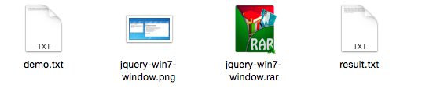

> This is a spider for html5tricks: [html5tricks](http://www.html5tricks.com/).

## Usage

* Configuration constants in a class `/src/main/java/cn/saymagic/spider/html5trick/Constants.java`

* Just run : `/Html5trickSpider/src/main/java/cn/saymagic/spider/html5trick/Starter.java`

* And you will download all demos from `html5tricks `:

---

---

---

